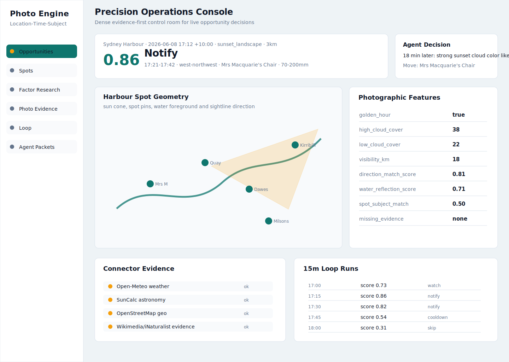
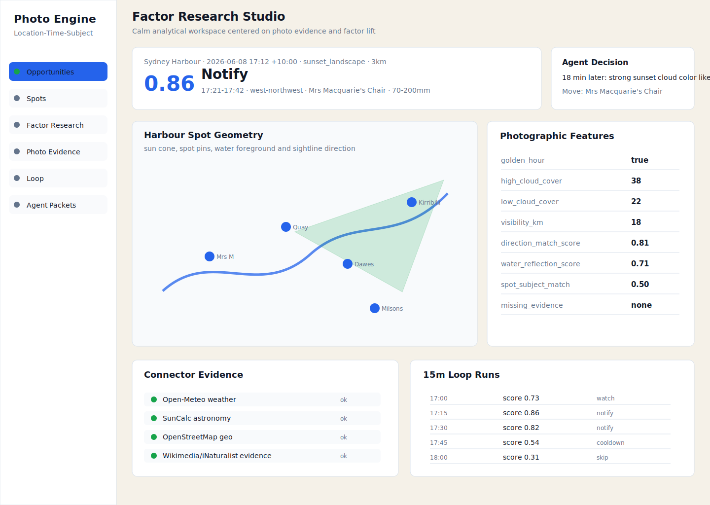

# Photo Opportunity Engine

Open-source Location-Time-Subject engine for deciding when a place is worth photographing.

It is not a generic world model. It is a photography-specific opportunity system that asks:

```text
At this location, at this time, for this subject, is it worth shooting or notifying the photographer?
```

## What It Does

- Collects weather from Open-Meteo.
- Computes sun and moon geometry locally with SunCalc.
- Queries nearby geography and viewpoints from OpenStreetMap / Overpass.
- Uses a curated photo spot library with directions, subjects, lenses, foregrounds, and risks.
- Converts raw evidence into photographic features such as golden hour, high cloud, visibility, reflection, direction match, and travel cost.
- Scores opportunities with explainable rules.
- Sends a SpecX-governed packet to an LLM-backed Agent for the final notify / skip / blocked decision.
- Builds a photo evidence database for factor research from Wikimedia Commons, iNaturalist, and optional Flickr.
- Validates factors at the `spot_id + source + source_photo_id` level.

## Screens

Main product console:



Factor research direction:



## Quick Start

```bash
python3 -m pip install -r requirements.txt
npm install
cp .env.example .env
npm run start
```

Open:

```text
http://127.0.0.1:8001/app
```

API:

```text
http://127.0.0.1:8001
```

## Agent Runtime

Configure `.env`:

```text
MINIMAX_API_KEY=...
MINIMAX_BASE_URL=https://api.minimaxi.com/v1
MINIMAX_MODEL=MiniMax-M3
MINIMAX_THINKING_TYPE=disabled
```

`.env` is ignored by git and is not included in release packages.

The score engine is not the Agent. Final notification judgment belongs to the LLM-backed Agent runtime under the SpecX contract.

## Verify Contracts

```bash
npm run specx
```

## Core Architecture

```text
Weather / Astronomy / Geo / Spot Tools
  -> Photography Feature Layer
  -> Opportunity Score
  -> Agent Decision Packet
  -> LLM Agent Decision
  -> Notification / Feedback / Memory
```

Important files:

- `app/orchestrator.py`: data collection, feature extraction, scoring, Agent packet.
- `app/opportunity_engine.py`: photography features and opportunity scoring.
- `app/agent_runtime.py`: MiniMax-M3 Agent runtime, thinking disabled.
- `app/opportunity_loop.py`: manual checks, 15-minute loop, daily digest.
- `app/memory_store.py`: user profile, accepted / ignored alerts, shooting history.
- `app/opportunity_database.py`: photo evidence and factor research database.
- `web/`: static dashboard frontend mounted at `/app`.

## Opportunity API

```bash
curl -X POST http://127.0.0.1:8001/opportunity \
  -H 'Content-Type: application/json' \
  -d '{
    "location": {"lat": -33.8568, "lng": 151.2153},
    "time": "2026-06-08T17:12:00+10:00",
    "radius_m": 3000,
    "subject": "sunset_landscape"
  }'
```

LLM Agent decision:

```bash
curl -X POST http://127.0.0.1:8001/agent/decide \
  -H 'Content-Type: application/json' \
  -d '{
    "location": {"lat": -33.8568, "lng": 151.2153},
    "time": "2026-06-08T17:12:00+10:00",
    "radius_m": 3000,
    "subject": "sunset_landscape"
  }'
```

## Photo Evidence Database

Preferred photo source:

```bash
python3 scripts/cold_start_commons.py \
  --place-key sydney_opera_house \
  --category "Category:Sydney Opera House" \
  --pages 1 \
  --per-page 50
```

iNaturalist source for nature / wildlife:

```bash
python3 scripts/cold_start_inaturalist.py \
  --place-key sydney_nature \
  --lat -33.8568 \
  --lng 151.2153 \
  --radius-km 10 \
  --pages 1 \
  --per-page 50
```

Background spot-photo context enrichment:

```bash
curl -X POST "http://127.0.0.1:8001/photo-library/enrichment/start?batch_size=20&sleep_seconds=1&subject=sunset_landscape"
curl "http://127.0.0.1:8001/photo-library/enrichment/status"
curl "http://127.0.0.1:8001/opportunity-db/stats"
```

Factor research report:

```bash
python3 scripts/factor_research_report.py
```

The current validation unit is:

```text
spot_id + source + source_photo_id
```

That keeps spot-specific features such as `direction_match_score`, `travel_cost_score`, and `spot_subject_match_score` tied to the correct camera position.

## Public Release

This repository excludes:

- API keys
- `.env`
- runtime SQLite databases
- generated local photo evidence snapshots

See [docs/PROMOTION.md](docs/PROMOTION.md) for launch copy, distribution channels, and short product descriptions.

## License

ISC. See [LICENSE](LICENSE).
